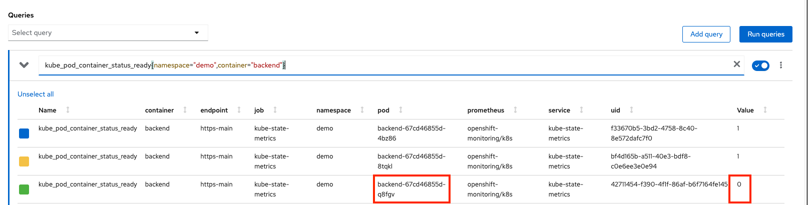
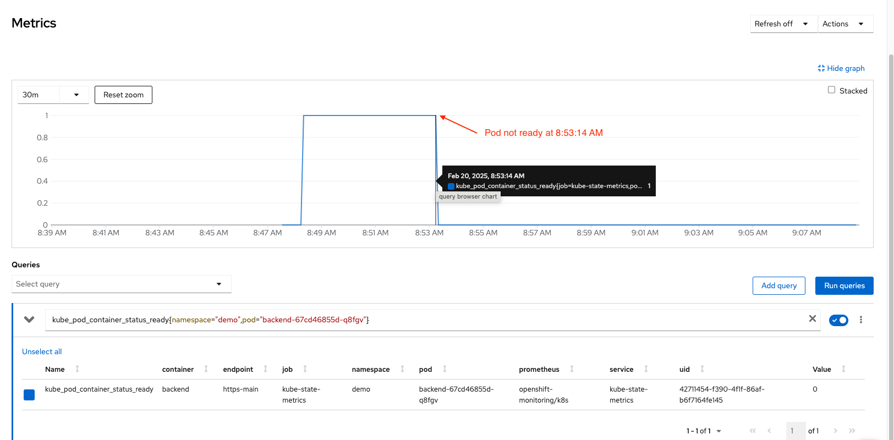
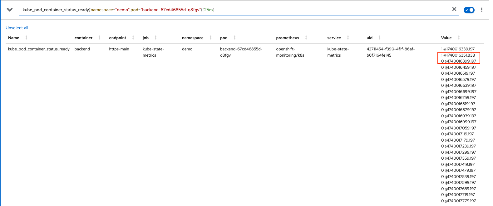
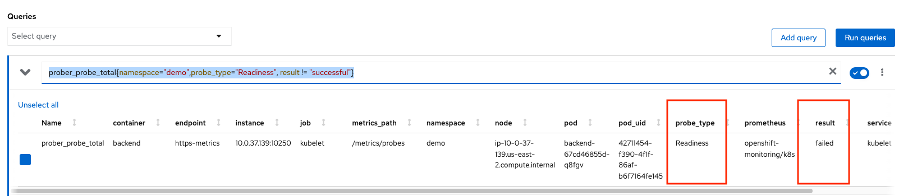
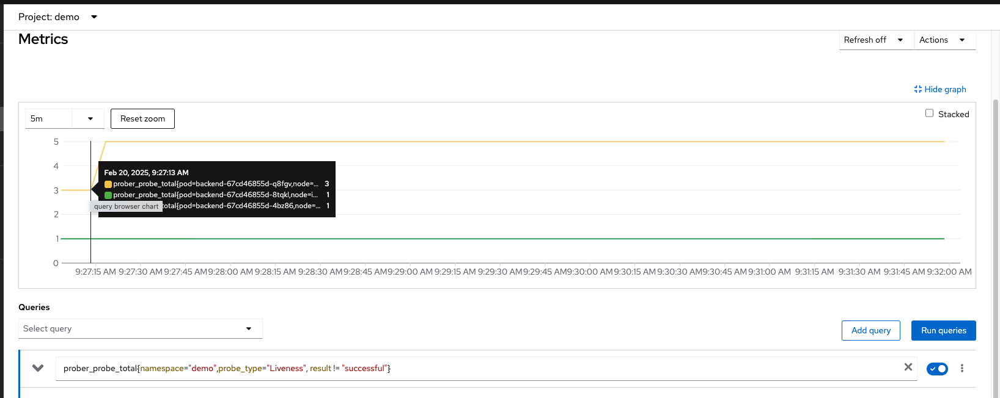
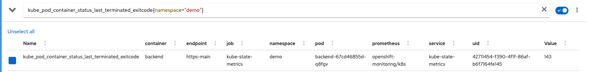

# PromQL for Day 2

## Liveness and Readiness

### Sample Application
- Deploy sample app in namespace demo
```bash
oc new-project demo --display-name "Demo Project"
oc apply -f backend.yaml 
oc set probe deployment/backend --liveness --get-url='http://:8080/q/health/live' --failure-threshold=3 --initial-delay-seconds=20 --period-seconds=5 
oc set probe deployment/backend --readiness --get-url='http://:8080/q/health/ready' --failure-threshold=1 --initial-delay-seconds=25 --period-seconds=5 
oc expose deploy backend --port=8080
oc create route edge --service=backend --port=8080
watch oc get po 
```
Output during pods are creating

```bash
NAME                       READY   STATUS    RESTARTS   AGE
backend-67cd46855d-4bz86   1/1     Running   0          65s
backend-67cd46855d-8tqkl   0/1     Running   0          5s
backend-67cd46855d-q8fgv   1/1     Running   0          35s
backend-6b9b954484-77xfr   1/1     Running   0          68s
```

Output when finish

```bash
NAME                       READY   STATUS    RESTARTS   AGE
backend-67cd46855d-4bz86   1/1     Running   0          119s
backend-67cd46855d-8tqkl   1/1     Running   0          59s
backend-67cd46855d-q8fgv   1/1     Running   0          89s
```

Press Ctrl-C to exit

- Force 1 backend pod to be not ready state

```bash
NOT_READY_POD=$(oc get po -o custom-columns='Name:.metadata.name' --no-headers=true | sort -r | head -n 1)
oc exec $NOT_READY_POD -- curl -v http://localhost:8080/not_ready
oc exec $NOT_READY_POD -- curl -s http://localhost:8080/q/health/ready
```
Output

```json
{
    "status": "DOWN",
    "checks": [
        {
            "name": "Ready",
            "status": "DOWN"
        }
    ]
}
```

Check pod status with *oc get po*

```bash
NAME                       READY   STATUS    RESTARTS   AGE
backend-67cd46855d-4bz86   1/1     Running   0          7m46s
backend-67cd46855d-8tqkl   1/1     Running   0          6m46s
backend-67cd46855d-q8fgv   0/1     Running   0          7m16s
```

### PromQL for check pod status

- Open Developer Console and select namespace *demo*, navigate to *Observe* then select *Metrics*
- PromQL for check pod status in namespace *demo* and container name is *backend*
  
  ```bash
  kube_pod_container_status_ready{namespace="demo",container="backend"}
  ```

  Result

  

  Filter for specific pod

  ```bash
  kube_pod_container_status_ready{namespace="demo",pod="backend-67cd46855d-q8fgv"}
  ```

  Result

  

  
  Filter for specific pod for last 25 minutes

  ```bash
  kube_pod_container_status_ready{namespace="demo",pod="backend-67cd46855d-q8fgv"}[25m]
  ```
 
  Result

  Time format is [epoch timestamp](https://www.epochconverter.com/). 
 
  
  


### PromQL for check pod status by probe type
#### Readiness Probe
- PromQL for check Readiness probe failed

  ```bash
  prober_probe_total{namespace="test",probe_type="Readiness", result != "successful"}
  ```

  Result

  

#### Liveness Probe
- Force 1 backend pod to be response with fail liveness

  ```bash
  oc exec $NOT_READY_POD -- curl -v http://localhost:8080/stop
  sleep 25
  oc get po
  ```

  Output

  ```bash
  NAME                       READY   STATUS    RESTARTS      AGE
  backend-67cd46855d-4bz86   1/1     Running   0             40m
  backend-67cd46855d-8tqkl   1/1     Running   0             39m
  backend-67cd46855d-q8fgv   0/1     Running   1 (15s ago)   39m
  ``` 
- Get pod status with exit code
  
  ```bash
  oc get po -o custom-columns='Name:.metadata.name,PHASE:.status.phase,NODE:.spec.nodeName,exitCode:.status.containerStatuses[0].lastState.terminated.exitCode,startedAt:.status.containerStatuses[0].lastState.terminated.startedAt,finishedAt:.status.containerStatuses[0].lastState.terminated.finishedAt'
  ```

  Output

  ```bash
  Name                       PHASE     NODE                                        exitCode   startedAt              finishedAt
  backend-67cd46855d-4bz86   Running   ip-10-0-12-213.us-east-2.compute.internal   <none>     <none>                 <none>
  backend-67cd46855d-8tqkl   Running   ip-10-0-58-92.us-east-2.compute.internal    <none>     <none>                 <none>
  backend-67cd46855d-q8fgv   Running   ip-10-0-37-139.us-east-2.compute.internal   143        2025-02-20T01:47:31Z   2025-02-20T02:26:51Z
  ```

- PromQL to query pod liveness status
  
  ```bash
  prober_probe_total{namespace="demo",probe_type="Liveness", result != "successful"}
  ```

  Result

  

- PromQL to query pod's exit code

  ```bash
  kube_pod_container_status_last_terminated_exitcode{namespace="demo"}
  ``` 

  Result

  


<!-- - PromQL for check Livenss probe failed

```
kube_pod_container_status_ready{pod="backend-6bdc895897-59qk7",namespace="test"}
prober_probe_total{namespace="test",probe_type="Liveness", result != "successful"}
kube_pod_container_status_last_terminated_exitcode{namespace="test",exit_code="143"}
```

- PromQL query pod exit code

```
kube_pod_container_status_last_terminated_exitcode{namespace="test",exit_code="143"}
```
- PromQL query error pod and OOMKilled

```
kube_pod_container_status_last_terminated_reason{namespace="test",reason="Error"}
kube_pod_container_status_last_terminated_reason{namespace="test",reason="OOMKilled"}
kube_pod_container_status_last_terminated_exitcode{namespace="test",exit_code="137"}
```
## Memory Leak -->
